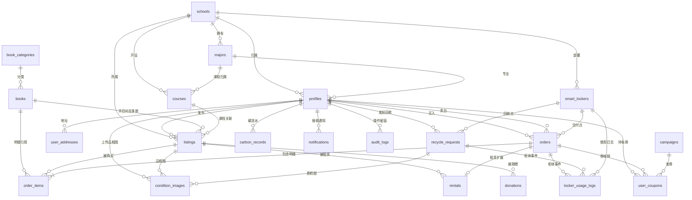

# 青阅循环 · 数据模型设计（Data Model / ER）

> 文档版本：v0.1.0 ｜ 阶段：0（设计）
> 落地产物：阶段 2 交付 `supabase/migrations/*.sql` 与 `supabase/seed.sql`
> **ER 图文字版见第 7 节**（同时给出 Mermaid 图）

---

## 1. 设计总览

共 **24 张表**，按业务域分 6 组：

| 分组 | 表 | 数量 |
|---|---|---|
| A 用户与学校 | `profiles` `schools` `majors` `courses` | 4 |
| B 图书与交易 | `books` `listings` `orders` `recycle_requests` | 4 |
| C 碳账户与积分 | `carbon_records` `user_coupons` `campaigns` | 3 |
| D 智能硬件 | `smart_lockers` `locker_usage_logs` `condition_images` | 3 |
| E 算法与定价 | `pricing_rules` `sensitivity_analysis` `cashflow_forecast` | 3 |
| F 支撑 | `notifications` `audit_logs` `user_addresses` `book_categories` `order_items` `rentals` `donations` | 7 |

> 说明：`order_items`、`rentals`、`donations`、`user_addresses`、`book_categories` 是为支撑业务闭环
> 而必须补充的表（计划书未列出但业务需要），已在上表标注。

## 2. 通用约定

| 约定 | 规则 |
|---|---|
| 主键 | `id uuid primary key default gen_random_uuid()` |
| 时间戳 | `created_at timestamptz not null default now()`、`updated_at timestamptz not null default now()` |
| 软删除 | 业务表增加 `deleted_at timestamptz`，查询默认过滤 |
| 审计字段 | 关键表增加 `created_by uuid references auth.users(id)` |
| 金额 | 一律 `numeric(12,2)`，**禁止用 float**（避免精度丢失） |
| 枚举 | 用 PostgreSQL `enum` 类型（见第 3 节） |
| 更新时间 | 统一触发器 `set_updated_at()` |
| 命名 | 表名复数下划线；外键 `<单数表名>_id` |
| 时区 | 全部 `timestamptz`，展示层转 UTC+8 |

## 3. 枚举类型（15 个）

```sql
-- 用户与学校
create type user_role        as enum ('student', 'ambassador', 'operator', 'admin');
create type verify_status    as enum ('unverified', 'pending', 'verified', 'rejected');

-- 图书与品相
create type book_condition   as enum ('new', 'like_new', 'good', 'fair', 'poor');
--                           对应：全新 / 9成新 / 8成新 / 7成新 / 有瑕疵

-- 交易类型与状态
create type listing_type     as enum ('sell', 'exchange', 'rent', 'donate');
create type listing_status   as enum ('draft', 'pending_review', 'active', 'reserved',
                                      'sold', 'exchanging', 'rented', 'donated',
                                      'rejected', 'delisted');
create type order_type       as enum ('purchase', 'recycle', 'exchange', 'rental', 'donation');
create type order_status     as enum ('pending_payment', 'paid', 'awaiting_delivery',
                                      'delivering', 'completed', 'cancelled',
                                      'refunding', 'refunded', 'disputed');
create type payment_method   as enum ('mock', 'wechat', 'alipay');   -- 本期仅 mock 可用
create type delivery_method  as enum ('self_pickup', 'campus_delivery', 'locker', 'door_pickup');

-- 回收
create type recycle_status   as enum ('submitted', 'confirmed', 'picked_up',
                                      'inspecting', 'priced', 'settled', 'cancelled');

-- 碳账户与积分
create type carbon_action    as enum ('recycle', 'donate', 'exchange', 'buy_secondhand', 'rent');
create type coupon_status    as enum ('unused', 'used', 'expired');

-- 智能硬件
create type locker_status    as enum ('online', 'offline', 'maintenance', 'fault');
create type locker_event     as enum ('deposit', 'pickup', 'inspect', 'fault', 'maintenance');

-- 支撑
create type notification_type as enum ('order', 'recycle', 'carbon', 'campaign', 'system');
create type audit_action      as enum ('insert', 'update', 'delete', 'login', 'export');
```

## 4. 表结构详细设计

### 4.1 A 组 · 用户与学校

#### `schools` 学校

| 列 | 类型 | 约束 | 说明 |
|---|---|---|---|
| id | uuid | PK | |
| name | text | not null, unique | 学校名称 |
| province | text | | 省份 |
| city | text | | 城市 |
| level | text | | 本科/专科/职业院校 |
| is_active | boolean | not null default true | 是否开放服务 |
| created_at / updated_at | timestamptz | not null | |

索引：`idx_schools_province` on (province)

#### `majors` 专业

| 列 | 类型 | 约束 | 说明 |
|---|---|---|---|
| id | uuid | PK | |
| school_id | uuid | FK → schools(id) on delete cascade | |
| name | text | not null | 专业名称 |
| college | text | | 所属学院 |
| created_at / updated_at | timestamptz | not null | |

索引：`idx_majors_school` on (school_id)；唯一约束 (school_id, name)

#### `courses` 课程

| 列 | 类型 | 约束 | 说明 |
|---|---|---|---|
| id | uuid | PK | |
| school_id | uuid | FK → schools(id) on delete cascade | |
| major_id | uuid | FK → majors(id) on delete set null | 可为公共课 |
| name | text | not null | 课程名 |
| semester | text | | 如 `2026-spring` |
| enroll_count | integer | not null default 0 check (>=0) | **选课人数，供需系数的输入** |
| created_at / updated_at | timestamptz | not null | |

索引：`idx_courses_school_major` on (school_id, major_id)；`idx_courses_semester`

#### `profiles` 用户档案

> 与 `auth.users` 一对一，`id` 直接引用 `auth.users(id)`。

| 列 | 类型 | 约束 | 说明 |
|---|---|---|---|
| id | uuid | PK, FK → auth.users(id) on delete cascade | |
| nickname | text | | 昵称 |
| avatar_url | text | | 头像（Storage 路径） |
| phone | text | | **敏感**，建议应用层加密，展示脱敏 |
| role | user_role | not null default 'student' | 角色 |
| school_id | uuid | FK → schools(id) on delete set null | |
| major_id | uuid | FK → majors(id) on delete set null | |
| grade | smallint | check (grade between 1 and 8) | 年级 |
| enroll_year | smallint | | 入学年份 |
| verify_status | verify_status | not null default 'unverified' | 学生认证状态 |
| verified_at | timestamptz | | 认证通过时间 |
| credit_score | integer | not null default 100 check (>=0) | 信用分 |
| blacklist_reason | text | | 版权违规黑名单原因（计划书 9.1） |
| points_balance | integer | not null default 0 check (>=0) | 积分余额（冗余，便于读取） |
| carbon_total_kg | numeric(10,3) | not null default 0 | 累计减排（冗余） |
| created_at / updated_at / deleted_at | timestamptz | | |

索引：`idx_profiles_school` on (school_id)；`idx_profiles_role`；`idx_profiles_verify`

#### `user_addresses` 收货/收书地址

| 列 | 类型 | 约束 | 说明 |
|---|---|---|---|
| id | uuid | PK | |
| user_id | uuid | FK → profiles(id) on delete cascade | |
| label | text | | 如「3号宿舍楼」 |
| campus_area | text | | 校区 |
| building | text | | 楼栋（**精度到楼栋，不要求门牌**） |
| detail | text | | 补充说明，加密存储 |
| is_default | boolean | not null default false | |
| created_at / updated_at | timestamptz | | |

### 4.2 B 组 · 图书与交易

#### `book_categories` 图书分类

| 列 | 类型 | 约束 | 说明 |
|---|---|---|---|
| id | uuid | PK | |
| name | text | not null, unique | 如「高等数学」 |
| parent_id | uuid | FK → book_categories(id) | 支持二级分类 |
| sort_order | integer | not null default 0 | |

#### `books` 图书元数据（书目，非具体一册）

| 列 | 类型 | 约束 | 说明 |
|---|---|---|---|
| id | uuid | PK | |
| isbn | text | unique | **权威库比对的关键字段** |
| title | text | not null | |
| subtitle | text | | |
| author | text | | |
| publisher | text | | |
| publish_date | date | | |
| list_price | numeric(12,2) | check (>=0) | **图书定价**，定价公式第一个输入 |
| category_id | uuid | FK → book_categories(id) | |
| cover_url | text | | 封面图 |
| language | text | default 'zh' | |
| is_verified | boolean | not null default false | 是否通过 ISBN 权威库校验 |
| source_note | text | | 元数据来源说明（可核验要求） |
| created_at / updated_at | timestamptz | | |

索引：`idx_books_isbn`；`idx_books_title_trgm`（GIN，支持模糊搜索）；`idx_books_category`

> ⚠️ **版权风控第一层**：`is_verified = false` 的书目不允许上架（计划书 9.1 节）。

#### `listings` 图书挂牌（具体某一册）

| 列 | 类型 | 约束 | 说明 |
|---|---|---|---|
| id | uuid | PK | |
| seller_id | uuid | FK → profiles(id) on delete cascade | |
| book_id | uuid | FK → books(id) on delete restrict | |
| listing_type | listing_type | not null default 'sell' | 出售/换书/租赁/捐赠 |
| status | listing_status | not null default 'draft' | |
| condition | book_condition | not null | 品相自评 |
| condition_ai | book_condition | | **AI 判定结果（占位）** |
| condition_final | book_condition | | **人工复核终值（质检）** |
| ai_confidence | numeric(4,3) | check (between 0 and 1) | AI 置信度（占位） |
| need_manual_review | boolean | not null default false | 置信度低 → 人工队列 |
| price | numeric(12,2) | check (>=0) | 最终售价 |
| original_price | numeric(12,2) | | 挂牌时的估价 |
| deposit | numeric(12,2) | | 租赁押金（= 售价 × 80%） |
| rental_price_month | numeric(12,2) | | 月租金 |
| description | text | | |
| school_id | uuid | FK → schools(id) | **冗余，用于同校筛选与 RLS** |
| course_id | uuid | FK → courses(id) on delete set null | 关联课程 |
| delivery_method | delivery_method | | 交付方式 |
| view_count | integer | not null default 0 | |
| published_at | timestamptz | | |
| sold_at | timestamptz | | |
| created_at / updated_at / deleted_at | timestamptz | | |

索引：
- `idx_listings_school_status` on (school_id, status) —— **首页主查询**
- `idx_listings_course` on (course_id)
- `idx_listings_seller` on (seller_id)
- `idx_listings_book` on (book_id)
- `idx_listings_price` on (price)
- `idx_listings_search` GIN on (title 向量) —— 若做全文检索

#### `orders` 订单

| 列 | 类型 | 约束 | 说明 |
|---|---|---|---|
| id | uuid | PK | |
| order_no | text | not null, unique | 对外订单号（如 `QY202601150001`） |
| order_type | order_type | not null | |
| status | order_status | not null default 'pending_payment' | |
| buyer_id | uuid | FK → profiles(id) | 买方 |
| seller_id | uuid | FK → profiles(id) | 卖方 |
| school_id | uuid | FK → schools(id) | |
| total_amount | numeric(12,2) | not null check (>=0) | |
| deposit_amount | numeric(12,2) | not null default 0 | 租赁押金 |
| discount_amount | numeric(12,2) | not null default 0 | |
| payable_amount | numeric(12,2) | not null check (>=0) | |
| payment_method | payment_method | default 'mock' | **本期仅 mock** |
| paid_at | timestamptz | | |
| delivery_method | delivery_method | | |
| address_id | uuid | FK → user_addresses(id) on delete set null | |
| locker_id | uuid | FK → smart_lockers(id) on delete set null | 走智能柜时 |
| pickup_code | text | | 取件码 |
| completed_at | timestamptz | | |
| cancelled_at | timestamptz | | |
| cancel_reason | text | | |
| remark | text | | |
| created_at / updated_at | timestamptz | | |

索引：`idx_orders_buyer` on (buyer_id, created_at desc)；`idx_orders_seller`；`idx_orders_status`；`idx_orders_no`

#### `order_items` 订单明细

| 列 | 类型 | 约束 | 说明 |
|---|---|---|---|
| id | uuid | PK | |
| order_id | uuid | FK → orders(id) on delete cascade | |
| listing_id | uuid | FK → listings(id) on delete restrict | |
| book_id | uuid | FK → books(id) | 冗余，便于报表 |
| quantity | integer | not null default 1 check (>0) | |
| unit_price | numeric(12,2) | not null check (>=0) | |
| subtotal | numeric(12,2) | not null check (>=0) | |
| created_at | timestamptz | | |

#### `recycle_requests` 回收请求

| 列 | 类型 | 约束 | 说明 |
|---|---|---|---|
| id | uuid | PK | |
| request_no | text | not null, unique | |
| user_id | uuid | FK → profiles(id) on delete cascade | |
| school_id | uuid | FK → schools(id) | |
| status | recycle_status | not null default 'submitted' | |
| delivery_method | delivery_method | not null | 上门/回收点/智能柜 |
| locker_id | uuid | FK → smart_lockers(id) on delete set null | |
| address_id | uuid | FK → user_addresses(id) on delete set null | |
| expected_time | timestamptz | | 预约时间 |
| book_count | integer | not null default 0 check (>=0) | |
| estimated_amount | numeric(12,2) | | 预估金额 |
| final_amount | numeric(12,2) | | 质检后结算金额 |
| inspector_id | uuid | FK → profiles(id) on delete set null | 质检员 |
| inspected_at | timestamptz | | |
| settle_note | text | | 结算说明 |
| created_at / updated_at | timestamptz | | |

索引：`idx_recycle_user`；`idx_recycle_status`；`idx_recycle_school`

#### `rentals` 租赁记录

| 列 | 类型 | 约束 | 说明 |
|---|---|---|---|
| id | uuid | PK | |
| order_id | uuid | FK → orders(id) on delete cascade | |
| listing_id | uuid | FK → listings(id) | |
| renter_id | uuid | FK → profiles(id) | |
| start_date | date | not null | |
| due_date | date | not null | |
| returned_at | timestamptz | | |
| rent_amount | numeric(12,2) | not null | |
| deposit_amount | numeric(12,2) | not null | |
| overdue_days | integer | not null default 0 | |
| overdue_fee | numeric(12,2) | not null default 0 | **0.5 元/日** |
| condition_before | book_condition | | 出借品相 |
| condition_after | book_condition | | 归还复核品相 |
| deduction_amount | numeric(12,2) | not null default 0 | 降级差价扣除 |
| deduction_reason | text | | |
| created_at / updated_at | timestamptz | | |

#### `donations` 公益捐赠

| 列 | 类型 | 约束 | 说明 |
|---|---|---|---|
| id | uuid | PK | |
| donor_id | uuid | FK → profiles(id) on delete set null | 可匿名 |
| listing_id | uuid | FK → listings(id) on delete set null | |
| school_id | uuid | FK → schools(id) | |
| partner_org | text | | 受赠机构 |
| book_count | integer | not null check (>0) | |
| carbon_kg | numeric(10,3) | not null default 0 | 计入碳账户 |
| status | text | not null default 'pending' | |
| delivered_at | timestamptz | | |
| created_at / updated_at | timestamptz | | |

### 4.3 C 组 · 碳账户与积分

#### `carbon_records` 碳账户流水

| 列 | 类型 | 约束 | 说明 |
|---|---|---|---|
| id | uuid | PK | |
| user_id | uuid | FK → profiles(id) on delete cascade | |
| action | carbon_action | not null | |
| ref_table | text | | 关联表名（orders/listings/donations） |
| ref_id | uuid | | 关联记录 id |
| book_count | integer | not null default 1 check (>0) | |
| carbon_kg | numeric(10,3) | not null | **单册减排量 × 册数** |
| factor_used | numeric(10,4) | not null | **实际使用的减排系数** |
| factor_source | text | not null | **系数来源说明（可核验要求）** |
| is_estimated | boolean | not null default true | **true = 测算值，非实测** |
| created_at | timestamptz | | |

索引：`idx_carbon_user` on (user_id, created_at desc)

> ⚠️ **数据可核验要求**：`factor_source` 不能为空，`is_estimated = true` 时
> 前端必须同步展示「测算参数，非实测值」。这是计划书「不虚构数据」原则的系统级落实。

#### `user_coupons` 用户优惠券/积分兑换券

| 列 | 类型 | 约束 | 说明 |
|---|---|---|---|
| id | uuid | PK | |
| user_id | uuid | FK → profiles(id) on delete cascade | |
| campaign_id | uuid | FK → campaigns(id) on delete set null | |
| code | text | not null, unique | 券码 |
| title | text | not null | |
| discount_amount | numeric(12,2) | check (>=0) | 抵扣金额 |
| discount_rate | numeric(4,3) | check (between 0 and 1) | 折扣率 |
| min_amount | numeric(12,2) | not null default 0 | 门槛 |
| points_cost | integer | not null default 0 | 消耗积分 |
| status | coupon_status | not null default 'unused' | |
| expired_at | timestamptz | | |
| used_at | timestamptz | | |
| used_order_id | uuid | FK → orders(id) on delete set null | |
| created_at / updated_at | timestamptz | | |

#### `campaigns` 营销活动

| 列 | 类型 | 约束 | 说明 |
|---|---|---|---|
| id | uuid | PK | |
| title | text | not null | 如「毕业季旧书换绿植」 |
| campaign_type | text | not null | graduation / semester_start / daily / donation |
| description | text | | |
| school_id | uuid | FK → schools(id) on delete set null | null = 全平台 |
| points_reward | integer | not null default 0 | 参与奖励积分 |
| start_at / end_at | timestamptz | not null | |
| is_active | boolean | not null default true | |
| cover_url | text | | |
| created_at / updated_at | timestamptz | | |

### 4.4 D 组 · 智能硬件

#### `smart_lockers` 智能回收柜

| 列 | 类型 | 约束 | 说明 |
|---|---|---|---|
| id | uuid | PK | |
| code | text | not null, unique | 设备编号 |
| name | text | not null | 如「3号宿舍楼A柜」 |
| school_id | uuid | FK → schools(id) on delete restrict | |
| campus_area | text | | 校区 |
| location_desc | text | | 位置描述 |
| latitude / longitude | numeric(10,7) | | 坐标 |
| total_slots | integer | not null default 0 check (>=0) | 总格口 |
| used_slots | integer | not null default 0 check (>=0) | 已用格口 |
| status | locker_status | not null default 'offline' | |
| last_heartbeat_at | timestamptz | | 最近心跳 |
| firmware_version | text | | |
| installed_at | date | | |
| created_at / updated_at | timestamptz | | |

索引：`idx_lockers_school`；`idx_lockers_status`

#### `locker_usage_logs` 柜体使用日志

| 列 | 类型 | 约束 | 说明 |
|---|---|---|---|
| id | uuid | PK | |
| locker_id | uuid | FK → smart_lockers(id) on delete cascade | |
| user_id | uuid | FK → profiles(id) on delete set null | |
| event | locker_event | not null | |
| slot_no | integer | | 格口号 |
| order_id | uuid | FK → orders(id) on delete set null | |
| recycle_request_id | uuid | FK → recycle_requests(id) on delete set null | |
| payload | jsonb | not null default '{}'::jsonb | 原始上报内容 |
| occurred_at | timestamptz | not null default now() | |
| created_at | timestamptz | | |

索引：`idx_locker_logs_locker_time` on (locker_id, occurred_at desc)

> ⚠️ 计划书 3.3 节要求「日志审计」与「网络中断时柜端离线暂存、恢复后补传」，
> 因此 `occurred_at`（设备端时间）与 `created_at`（入库时间）必须分开记录。

#### `condition_images` 品相图片与识别结果

| 列 | 类型 | 约束 | 说明 |
|---|---|---|---|
| id | uuid | PK | |
| listing_id | uuid | FK → listings(id) on delete cascade | |
| recycle_request_id | uuid | FK → recycle_requests(id) on delete cascade | |
| storage_path | text | not null | **Storage 私有桶路径，不存公开 URL** |
| image_type | text | not null | cover / inner / defect / spine |
| ai_model | text | | 模型名（占位，如 `yolov8-mock`） |
| ai_labels | jsonb | | 缺陷标签与置信度（占位） |
| ai_condition | book_condition | | AI 判定品相 |
| ai_confidence | numeric(4,3) | check (between 0 and 1) | |
| manual_condition | book_condition | | 人工复核品相 |
| reviewer_id | uuid | FK → profiles(id) on delete set null | |
| reviewed_at | timestamptz | | |
| created_at | timestamptz | | |

> ⚠️ **隐私设计**：智能柜摄像头只拍图书，`image_type` 与上传流程均不含人像；
> 若未来需要人像，必须走 PIPIA 并单独同意（见 security-compliance.md 1.1）。

### 4.5 E 组 · 算法与定价

#### `pricing_rules` 定价规则（系数配置）

| 列 | 类型 | 约束 | 说明 |
|---|---|---|---|
| id | uuid | PK | |
| rule_type | text | not null | base_discount / condition / supply_demand / time_decay |
| rule_key | text | not null | 如 `like_new`、`good` |
| rule_value | numeric(10,4) | not null | 系数值 |
| min_value / max_value | numeric(10,4) | | 适用区间（如时效系数按周转天数分档） |
| school_id | uuid | FK → schools(id) on delete cascade | null = 平台默认 |
| source_note | text | not null | **来源说明（示例值/实测值）** |
| is_active | boolean | not null default true | |
| effective_from | timestamptz | not null default now() | |
| created_by | uuid | FK → profiles(id) on delete set null | |
| created_at / updated_at | timestamptz | | |

唯一约束：(rule_type, rule_key, school_id)
索引：`idx_pricing_active` on (rule_type, is_active)

> ⚠️ 计划书 3.2 节的系数（9成新 0.55、8成新 0.45 等）**均为示例数据**，
> 必须通过本表配置，并在 `source_note` 标注「示例值，待试点校准」。

#### `sensitivity_analysis` 敏感性分析（计划书 8.6 节）

| 列 | 类型 | 约束 | 说明 |
|---|---|---|---|
| id | uuid | PK | |
| scenario_name | text | not null | 保守 / 基准 / 乐观 |
| variable | text | not null | 回收成本 / 平均售价 / 综合售出率 / 月固定成本 |
| change_pct | numeric(6,2) | not null | 变动幅度（如 +10、-15） |
| impact_gross_margin | numeric(6,2) | | 对毛利率影响（百分点） |
| impact_monthly_profit | numeric(12,2) | | 对月毛利影响（元） |
| basis_note | text | not null | 测算依据 |
| is_example | boolean | not null default true | **示例数据标记** |
| created_at / updated_at | timestamptz | | |

#### `cashflow_forecast` 现金流预测（计划书 8.4 节）

| 列 | 类型 | 约束 | 说明 |
|---|---|---|---|
| id | uuid | PK | |
| scenario_name | text | not null | 保守 / 基准 / 乐观 |
| period_label | text | not null | 如 `Q1`、`2026-01` |
| period_start / period_end | date | not null | |
| revenue | numeric(12,2) | not null default 0 | 营业收入 |
| variable_cost | numeric(12,2) | not null default 0 | 变动成本 |
| fixed_cost | numeric(12,2) | not null default 0 | 固定成本 |
| hardware_capex | numeric(12,2) | not null default 0 | 硬件投入 |
| net_cashflow | numeric(12,2) | not null default 0 | 净现金流 |
| ending_cash | numeric(12,2) | not null default 0 | 期末现金 |
| is_example | boolean | not null default true | **示例数据标记** |
| created_at / updated_at | timestamptz | | |

唯一约束：(scenario_name, period_label)

### 4.6 F 组 · 支撑

#### `notifications` 通知

| 列 | 类型 | 约束 | 说明 |
|---|---|---|---|
| id | uuid | PK | |
| user_id | uuid | FK → profiles(id) on delete cascade | |
| type | notification_type | not null | |
| title | text | not null | |
| content | text | | |
| link | text | | 跳转路径 |
| is_read | boolean | not null default false | |
| read_at | timestamptz | | |
| created_at | timestamptz | | |

索引：`idx_notifications_user_unread` on (user_id, is_read, created_at desc)

#### `audit_logs` 审计日志

| 列 | 类型 | 约束 | 说明 |
|---|---|---|---|
| id | uuid | PK | |
| actor_id | uuid | FK → profiles(id) on delete set null | 操作人 |
| actor_role | user_role | | 操作时角色快照 |
| action | audit_action | not null | |
| table_name | text | not null | |
| record_id | uuid | | |
| before_data | jsonb | | 变更前（脱敏后） |
| after_data | jsonb | | 变更后（脱敏后） |
| ip_address | inet | | |
| user_agent | text | | |
| created_at | timestamptz | not null default now() | |

索引：`idx_audit_actor_time`；`idx_audit_table_record`

> ⚠️ **审计日志只可追加，不可修改/删除**。RLS 需禁止 UPDATE 与 DELETE。
> 留存 ≥6 个月（等保要求）。

## 5. RLS 策略设计

**总原则**：
1. 所有表 `ENABLE ROW LEVEL SECURITY` 且 `FORCE ROW LEVEL SECURITY`。
2. 「无策略 = 拒绝」（PostgreSQL 默认行为，但**必须显式写策略**避免误以为已保护）。
3. 权限判断一律基于 `auth.uid()` 与 `auth.jwt() ->> 'role'`，**不信任前端传参**。
4. 管理员判断走 `is_admin()` SECURITY DEFINER 函数，避免策略里重复子查询。

### 5.1 辅助函数

```sql
-- 当前用户是否管理员（SECURITY DEFINER 避免 RLS 递归）
create or replace function public.is_admin()
returns boolean
language sql
security definer
set search_path = public
as $$
  select exists (
    select 1 from public.profiles
    where id = auth.uid() and role = 'admin' and deleted_at is null
  );
$$;

-- 当前用户是否运营/管理员
create or replace function public.is_staff()
returns boolean
language sql
security definer
set search_path = public
as $$
  select exists (
    select 1 from public.profiles
    where id = auth.uid() and role in ('operator','admin') and deleted_at is null
  );
$$;

-- 当前用户所属学校
create or replace function public.current_school_id()
returns uuid
language sql
security definer
set search_path = public
as $$
  select school_id from public.profiles where id = auth.uid();
$$;
```

### 5.2 逐表策略

| 表 | SELECT | INSERT | UPDATE | DELETE |
|---|---|---|---|---|
| `schools` | 所有人（公开数据） | 仅 admin | 仅 admin | 仅 admin |
| `majors` | 所有人 | 仅 admin | 仅 admin | 仅 admin |
| `courses` | 所有人 | 仅 admin | 仅 admin | 仅 admin |
| `profiles` | 本人 或 同校（仅公开字段，敏感字段走视图） 或 staff | 仅本人（`id = auth.uid()`） | **仅本人**（且不可改 role/verify_status/points_balance，用列级权限+触发器保护） | 仅本人（软删） |
| `user_addresses` | 仅本人 或 admin | 仅本人 | 仅本人 | 仅本人 |
| `book_categories` | 所有人 | 仅 admin | 仅 admin | 仅 admin |
| `books` | 所有人（公开书目） | 认证用户 或 staff | staff（校验 ISBN 后置 `is_verified`） | 仅 admin |
| `listings` | `status='active'` 所有人；其余仅 seller / staff | 认证用户 且 `seller_id = auth.uid()` | **仅 seller 本人** 或 staff（质检字段） | 仅 seller（软删） |
| `orders` | **仅 buyer 或 seller** 或 staff | buyer 且 `buyer_id = auth.uid()` | buyer/seller 有限字段（状态由服务端流转）；staff 全量 | 仅 admin（软删需谨慎） |
| `order_items` | 随所属 order 可见性 | 随 order 创建（服务端） | 否 | 否 |
| `recycle_requests` | 仅 user 本人 或 staff | `user_id = auth.uid()` | 本人（限早期状态）或 staff | 仅 admin |
| `rentals` | 仅 renter / owner / staff | 服务端创建 | 服务端（归还核验） | 否 |
| `donations` | donor 本人、同校汇总公开、staff | `donor_id = auth.uid()` 或 staff | staff | 仅 admin |
| `carbon_records` | **仅本人** 或 staff | **仅服务端**（Edge Function，禁止前端直插） | **否（流水不可改）** | 否 |
| `user_coupons` | 仅本人 或 staff | 服务端 | 服务端（核销） | 否 |
| `campaigns` | 所有人（`is_active`） | 仅 admin | 仅 admin | 仅 admin |
| `smart_lockers` | 登录用户（只读基本信息） 或 staff | 仅 admin | 仅设备服务端 / admin | 仅 admin |
| `locker_usage_logs` | 仅本人相关 或 staff | **仅服务端**（webhook） | 否 | 否 |
| `condition_images` | listing/request 相关者 或 staff（**签名 URL**） | 登录用户（限自己） | staff（人工复核字段） | 仅 admin |
| `pricing_rules` | **仅 staff**（系数是商业机密） | 仅 admin | 仅 admin | 仅 admin |
| `sensitivity_analysis` | 仅 staff | 仅 admin | 仅 admin | 仅 admin |
| `cashflow_forecast` | 仅 staff | 仅 admin | 仅 admin | 仅 admin |
| `notifications` | 仅本人 | 服务端 | 仅本人（标记已读） | 仅本人 |
| `audit_logs` | 仅 admin | **仅服务端** | **禁止** | **禁止** |

### 5.3 策略示例（可直接用于阶段 2 迁移）

```sql
-- listings：公开可读已上架；卖家可管理自己的全部
alter table public.listings enable row level security;
alter table public.listings force row level security;

create policy listings_select_active on public.listings
  for select using (
    status = 'active' and deleted_at is null
  );

create policy listings_select_own on public.listings
  for select using (
    seller_id = auth.uid() or public.is_staff()
  );

create policy listings_insert_own on public.listings
  for insert with check (
    seller_id = auth.uid()
    and exists (select 1 from public.profiles
                where id = auth.uid() and verify_status = 'verified')
  );

create policy listings_update_own on public.listings
  for update using (seller_id = auth.uid())
  with check (seller_id = auth.uid());

create policy listings_delete_own on public.listings
  for delete using (seller_id = auth.uid() or public.is_admin());
```

```sql
-- orders：仅买卖双方可见
alter table public.orders enable row level security;
alter table public.orders force row level security;

create policy orders_select_participant on public.orders
  for select using (
    buyer_id = auth.uid() or seller_id = auth.uid() or public.is_staff()
  );

create policy orders_insert_buyer on public.orders
  for insert with check (buyer_id = auth.uid());
```

```sql
-- carbon_records：只读本人，写入仅服务端（用 service_role，天然绕过 RLS）
alter table public.carbon_records enable row level security;
alter table public.carbon_records force row level security;

create policy carbon_select_own on public.carbon_records
  for select using (user_id = auth.uid() or public.is_staff());

-- 不创建任何 insert/update/delete 策略 → 前端无法直写
-- Edge Function 使用 service_role 写入
```

```sql
-- audit_logs：只可追加，禁止改删
alter table public.audit_logs enable row level security;
alter table public.audit_logs force row level security;

create policy audit_select_admin on public.audit_logs
  for select using (public.is_admin());
-- 无 update / delete 策略 → 任何人（除 service_role）都无法修改
```

### 5.4 RLS 测试方法

阶段 2 交付 `tests/rls/rls_test.sql`，用三种身份验证：

```sql
-- 模拟学生 A：set local role authenticated; set local request.jwt.claims = '{"sub":"<uuid-A>"}';
-- 断言：能看到自己的订单，看不到 B 的订单，看不到 pricing_rules
-- 模拟学生 B：断言查不到 A 的 carbon_records
-- 模拟匿名：断言只能看到 status='active' 的 listings
```

## 6. 种子数据（示例数据，正式使用前必须替换）

| 表 | 条数 | 说明 |
|---|---|---|
| `schools` | 3 | 示例高校（**非真实合作院校**） |
| `majors` | 10 | 覆盖理工/文管/艺术 |
| `courses` | 12 | 含 `enroll_count`（示例值） |
| `book_categories` | 15 | 二年级分类 |
| `books` | 30 | 示例教材，1/3 标注 `is_verified = true` |
| `listings` | 40 | 覆盖 5 种品相、4 种交易类型 |
| `pricing_rules` | 12 | **全部 `source_note = '示例值，待试点校准'`** |
| `sensitivity_analysis` | 8 | 对应计划书 8.6 节 4 个变量 × 2 情景 |
| `cashflow_forecast` | 12 | 对应计划书 8.4 节 Q1-Q6 × 2 情景 |
| `campaigns` | 3 | 毕业季 / 开学季 / 日常 |
| `smart_lockers` | 2 | 模拟设备 |
| `profiles` | 5 | 测试账号（student / ambassador / operator / admin） |

> ⚠️ 种子数据**必须**在 SQL 顶部注释 `-- 示例数据，正式使用前替换为真实数据`，
> 且 `pricing_rules.source_note`、`sensitivity_analysis.basis_note` 不得留空。

## 7. ER 图

### 7.1 Mermaid 关系图



### 7.2 ER 图文字版（交接用）

```
【A 用户与学校】
  schools 1 ──< majors      （学校下设专业）
  schools 1 ──< courses     （学校开设课程，courses.major_id 可空=公共课）
  schools 1 ──< profiles    （学生归属学校）
  majors  1 ──< profiles    （学生所属专业）
  profiles 1 ──< user_addresses （学生的收货/收书地址）

【B 图书与交易】
  book_categories 1 ──< books        （书目分类，支持二级）
  books  1 ──< listings             （一个书目对应多个在售册）
  courses 1 ──< listings            （挂牌关联课程，支撑课程精准筛选）
  profiles 1 ──< listings           （seller 发布）
  listings 1 ──< order_items        （一册可被购买一次）
  orders 1 ──< order_items          （订单含多条明细）
  orders 1 ──1 rentals              （租赁订单的扩展信息）
  orders 1 ──< user_coupons         （券在订单中核销）
  profiles 1 ──< orders(buyer)      （买方）
  profiles 1 ──< orders(seller)     （卖方）
  profiles 1 ──< recycle_requests   （用户发起回收）
  profiles 1 ──< donations          （用户捐赠）
  listings 1 ──< rentals            （租赁记录）
  listings 1 ──< donations          （捐赠去向）

【C 碳账户与积分】
  profiles 1 ──< carbon_records     （碳流水，只增不改）
  campaigns 1 ──< user_coupons      （活动发券）
  profiles 1 ──< user_coupons       （用户持券）

【D 智能硬件】
  schools 1 ──< smart_lockers       （学校部署柜体）
  smart_lockers 1 ──< locker_usage_logs （柜体事件流水）
  smart_lockers 1 ──< orders        （柜体作为交付点）
  smart_lockers 1 ──< recycle_requests （柜体作为回收点）
  profiles 1 ──< locker_usage_logs  （操作人）
  listings 1 ──< condition_images   （品相图）
  recycle_requests 1 ──< condition_images （质检图）

【E 算法与定价】（全部仅 staff 可见）
  pricing_rules        独立表，按 (rule_type, rule_key, school_id) 唯一
  sensitivity_analysis 独立表，按 (scenario_name, variable) 组织
  cashflow_forecast    独立表，按 (scenario_name, period_label) 组织

【F 支撑】
  profiles 1 ──< notifications      （通知）
  profiles 1 ──< audit_logs         （操作审计，只增不改）
```

### 7.3 核心关系基数说明

| 关系 | 基数 | 业务含义 |
|---|---|---|
| books : listings | 1 : N | 一本《高等数学》有多个学生在卖 |
| orders : listings | N : 1（经 order_items） | 一个订单可买多册，一册只成交一次 |
| orders : rentals | 1 : 0..1 | 仅租赁类型订单有此扩展 |
| profiles : orders | 1 : N（双向） | 同一用户既买也卖 |
| carbon_records : orders | N : 1（弱引用 ref_id） | 一笔订单可能产生多条碳流水（买卖各计） |

## 8. 阶段 0 验收标准

- [x] 24 张表覆盖需求指定的全部表，并补齐业务必需的 5 张支撑表
- [x] 每表定义主键、外键、索引、默认值、时间戳
- [x] 16 个枚举类型覆盖全部状态字段（阶段 2 落地时确认为 16 个）
- [x] 每表给出 SELECT/INSERT/UPDATE/DELETE 四类 RLS 策略
- [x] 关键表给出可直接使用的策略 SQL 示例
- [x] 明确 RLS 测试方法（三种身份）
- [x] 种子数据清单，且示例值强制标注来源
- [x] ER 图同时提供 Mermaid 与文字版
- [x] 金额字段统一 numeric，碳系数强制带 source
